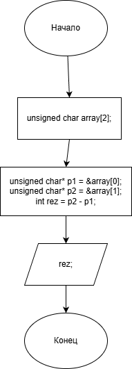

# 12Laba

### Условие задачи

5. Напишите программу, которая вычисляет размер основных типов данных в байтах: 5) unsigned char.

### Алгоритм

1. **Начало**

2. Создание массива типа unsigned char.
   
3. Создание указателей:

   `p1` - указатель первого элемента массива.
   
   `p2` - указатель второго элемента массива.

4. Вычисление разницы между указателями:

5. Вывод результата.

6. **Конец**

### Блок-схема
!
(https://viewer.diagrams.net/?tags=%7B%7D&lightbox=1&highlight=0000ff&edit=_blank&layers=1&nav=1&title=Lab12.png&dark=auto#R%3Cmxfile%3E%3Cdiagram%20name%3D%22%D0%A1%D1%82%D1%80%D0%B0%D0%BD%D0%B8%D1%86%D0%B0%20%E2%80%94%201%22%20id%3D%22vKg7L8X21BIwSFlcxruJ%22%3E7VjbbqMwEP0aXlbKiksCyWNzaRutuqo26u0pcsEFq4Aj4ySkX79jMAEDSdq02e1eXizP2MzYZ86MR2jWKEovGFoEV9TDoWbqXqpZY800HcOEUSg2UmHqucJnxMtVRqmYkRcslcW2JfFwomzklIacLFSlS%2BMYu1zRIcboWt32REPV6wL5uKGYuShsau%2BIx4Nc2zedUn%2BJiR8Ung17kK9EqNgsb5IEyKPrisqaaNaIUcrzWZSOcCiwK3DJvzvfsbo9GMMxf80Ho8vetxvndt7pT%2BfzW06CgFodGZ0VCpfywtpY1wZjMQ51bWxofaeYwzjMxom8EN8UKIEnCAgIw3VAOJ4tkCtW1kAJ0AU8CkEyYNo8tLzHCjOO04pKXuIC0whztoEtctXSJaCSUQW%2B6zI8RqELKqHpSx2SjPC3lkvQYCJxewOG3SaGDXxi70yQESQ3RElCXBUWRpexh4UTHSTAhm3uhfC1V4gP1bVxqkgbKe0EF3s1knPEfCz33NHu5Ob57nKadmfxdJCcf3%2F2OztCUMG41wJxoWM4RJysVJ9tuEsP15TAicsI2yZcvBpjQ68FL6FL5mL5XZX0DVOWasiuGcqRaBjKiLC9%2BPHcMK32BDuTiSTGPNl6WbLZnyq1us4vzC3j8WI%2B%2BRHT%2BxfrbHoVeNfPDLXVJ9MOwevQIyuY%2BmK6jBPix5A%2B8AwEiH0RMMBF9ewDOJmNIoGVHBlDG60HBa03zlDLzcHpKhZf6cQ85MR4o5Ocuwy%2FbA1nPjr5jXYbqnFGLSen541pq%2Blq2i28GbTwxjkVb1rS7p01OSW8UpJBepD7xLwsyEIo6vGH1%2FG86h0q22p535dWtXfh99X72otuHlntoYAphuzTVftWWJudgEjllgSFXnAhphBjFIY4pD5DEWxcYEbgEJjV167LhUP5%2FERSXDTSJ3oXrNe%2BC3X8Pyy%2Fe399fu%2FL24P53f1U%2BW30Vfo4xh%2Ba386%2Fybpuk3V7m93%2FtDuadvte9Qrtas2olv3ryDpOs%2Bg4398SNt6HFvbsbgkHKmZGW0vYFvwjngwQy98oOejlvyhr8hM%3D%3C%2Fdiagram%3E%3C%2Fmxfile%3E)

### 2. Реализация программы

    #include <stdio.h>
    
    #include <stdlib.h>
    
    #include <locale.h>
    
    #include <math.h>
    
    #define _USE_MATH_DEFINES 
    
    #define _CRT_SECURE_NO_DEPRECATE

    int main() {
    
	    setlocale(LC_CTYPE, "RUS");
      
	    unsigned char *p = 0;
      
	    unsigned char array[2];
      
	    unsigned char* p1 = &array[0];
      
	    unsigned char* p2 = &array[1];
      
	    int rez = p2 - p1;
      
	    printf("Размер unsigned char: %d байт\n", rez);

	    return 0;
      
    }

### 3. Результат работы программы

Размер unsigned char: 1 байт

### 4. Информация о разработчике

Гусев Иван бИЦ-252
